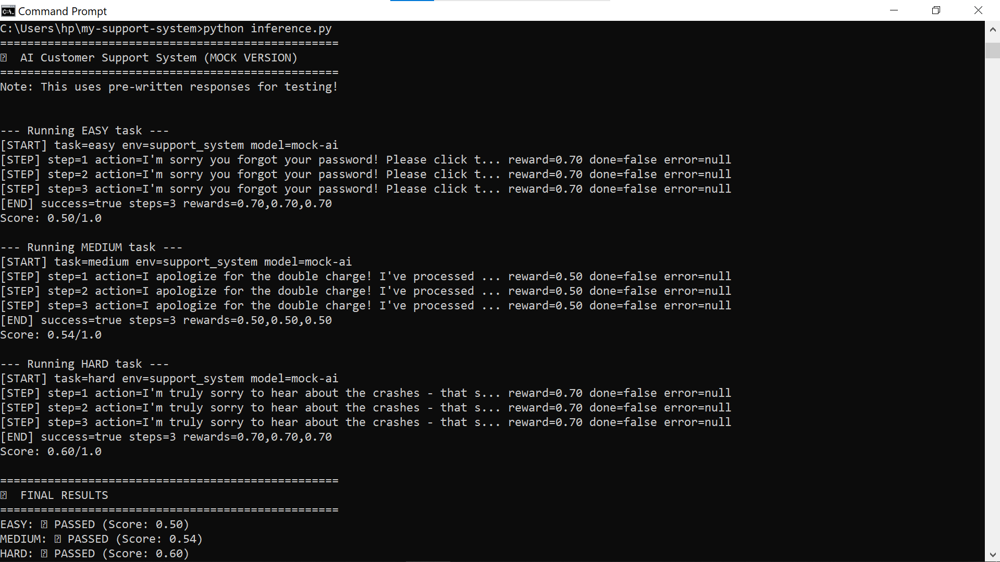

# AI Customer Support System 

## Overview
This is an AI-powered customer support system that helps customers with:
- Password reset issues (Easy)
- Double billing problems (Medium)
- App crash complaints (Hard)

## How It Works
The AI reads customer emails and writes professional responses. It gets scored on:
- Using helpful keywords
- Being polite and professional
- Avoiding rude words
- Providing complete answers

## Tasks
| Task | Difficulty | Description |
|------|-----------|-------------|
| password_reset | Easy | Help reset forgotten password |
| double_billing | Medium | Handle duplicate charges |
| app_crash_refund | Hard | Deal with angry customer |
 
 ## Technologies Used
  -Python
  -OpenAI API
  -Docker
  -YAML
  -Machine Learning Concepts

  ## 📂 Project Structure
ai-customer-support-system/

├── inference.py → Runs the AI responses
├── environment.py → Handles simulation logic
├── grader.py → Evaluates response quality
├── tasks.py → Defines customer support tasks
├── requirements.txt → Python dependencies
├── Dockerfile → Container configuration
├── openenv.yaml → Environment setup
├── test_ai.py → Functional testing
├── test_performance.py → Performance testing
├── README.md → Project documentation


---

## 🌐 Live Demo

Try the working project here:

https://huggingface.co/spaces/Naira21/customer-support

---

## 📸 Screenshots

Here is the output of the AI Customer Support System:



  
## Setup
```bash
pip install -r requirements.txt
python inference.py
---
